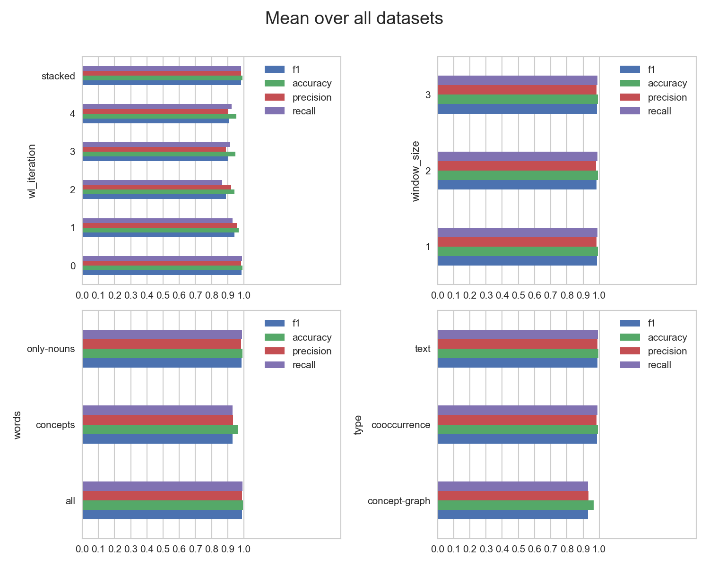
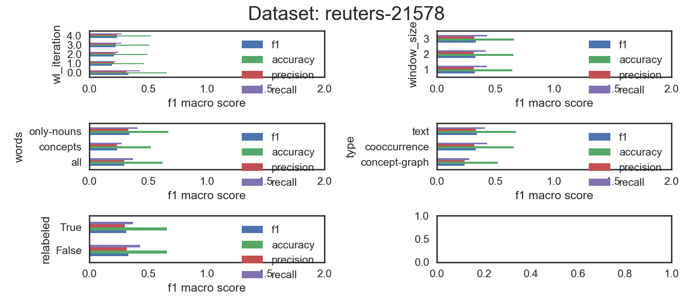
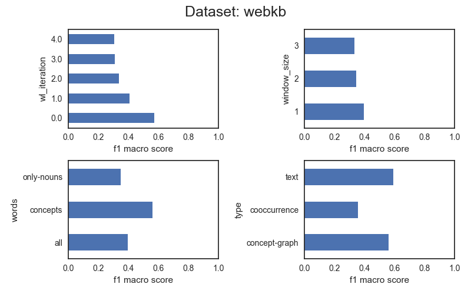
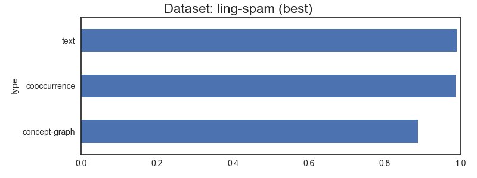
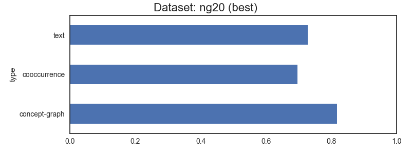
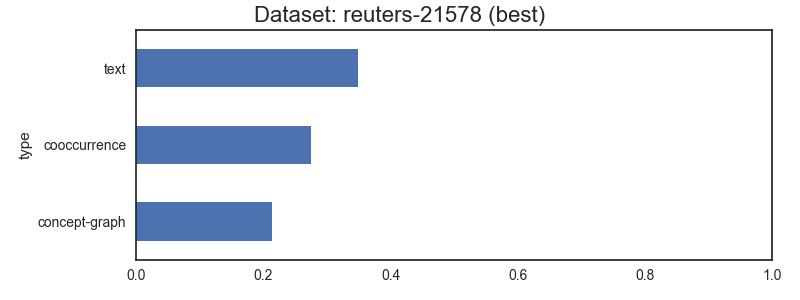
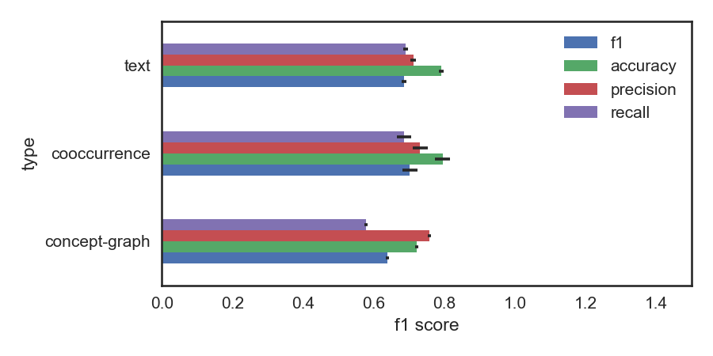

# (preliminary) Results

No co-reference currently.


## Mean of all classifiers








## Only the best classifier



```
concept-graph       best f1-score: 0.8855   words: concepts      wl iteration: 4       
cooccurrence        best f1-score: 0.9862   words: all           wl iteration: 0       window_size: 1
text                best f1-score: 0.9931   words: only-nouns    stop words:   english
```



```
concept-graph       best f1-score: 0.7087   words: concepts      wl iteration: 4       
cooccurrence        best f1-score: 0.6065   words: all           wl iteration: 0       window_size: 1
text                best f1-score: 0.7294   words: only-nouns    stop words:   english
```



```
concept-graph       best f1-score: 0.2135   words: concepts      wl iteration: 3       
cooccurrence        best f1-score: 0.2742   words: all           wl iteration: 0       window_size: 2
text                best f1-score: 0.3491   words: only-nouns    stop words:   english
```



```
concept-graph       best f1-score: 0.6424   words: concepts      wl iteration: 4       
cooccurrence        best f1-score: 0.7054   words: all           wl iteration: 0       window_size: 1
text                best f1-score: 0.6576   words: only-nouns    stop words:   english
```